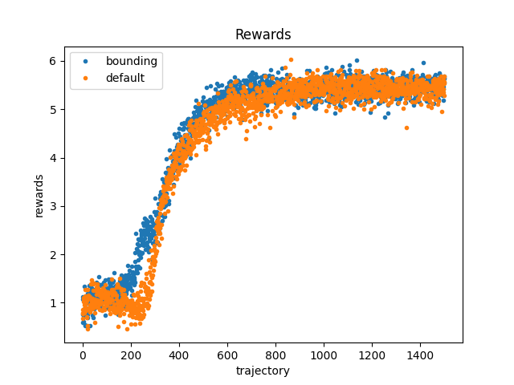

Проблема: оценки действий очень большие, от этого градиент может взрываться, а процесс обучения затрудняться.

Гипотеза: при нормировании наград нейросети алгоритм будет лучше обучаться, тем самым давать лучшие результаты.

Метрика: количество побед алгоритма увеличилось.

Был взят пайплайн обучения из предыдущего эксперимента (guidance_experiment).
Увеличено количество эпизодов обучения до тысячи пятисот.
В измененном пайплайне награды алгоритма были доделены на 100.
Пропорции и логика наград не изменены.

Оригинальный график наград был поделен на 100, чтобы графики стали одно масштаба.
Из графика ниже видно, что существенных изменений в обучении не произошло.

Количество побед на сто итераций:

Обычная система наград:

[16.  0. 13.  6. 11. 16.  7. 18.  7.  8.  6.]

Нормированная система наград:

[16. 23. 19.  4. 20. 13. 11.  5.  6.  3. 16.]

Todo: проверить, что результаты не отличаются